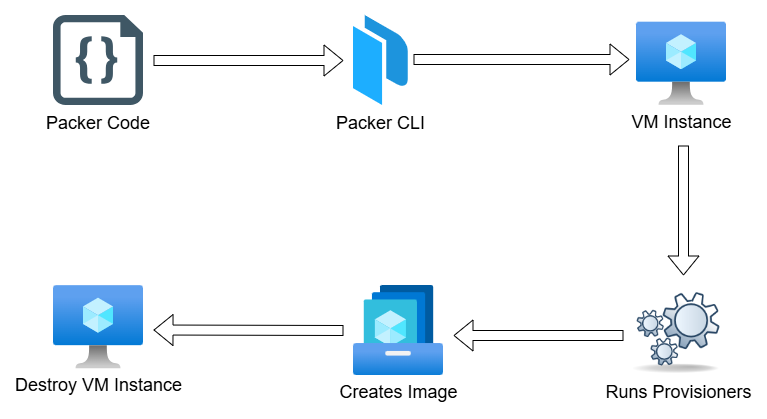
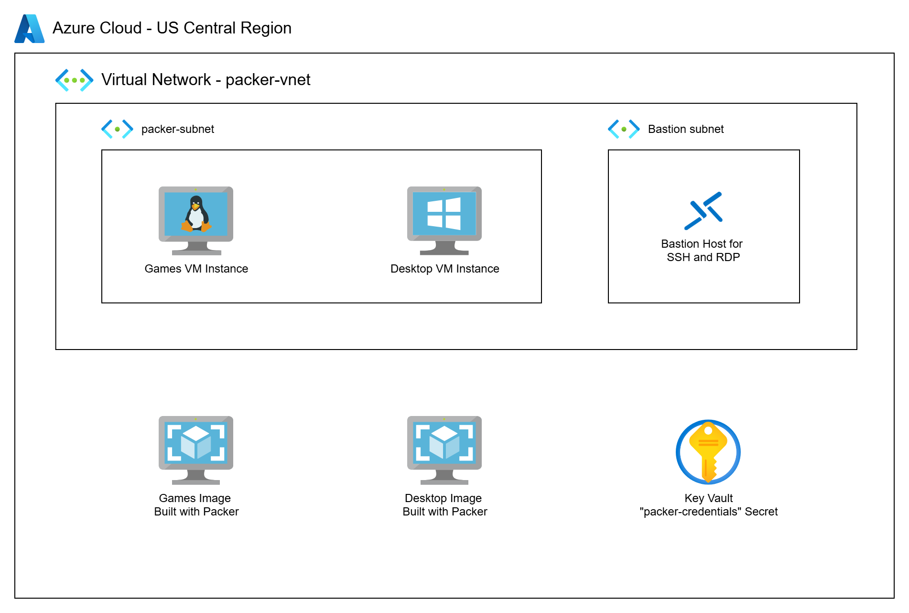
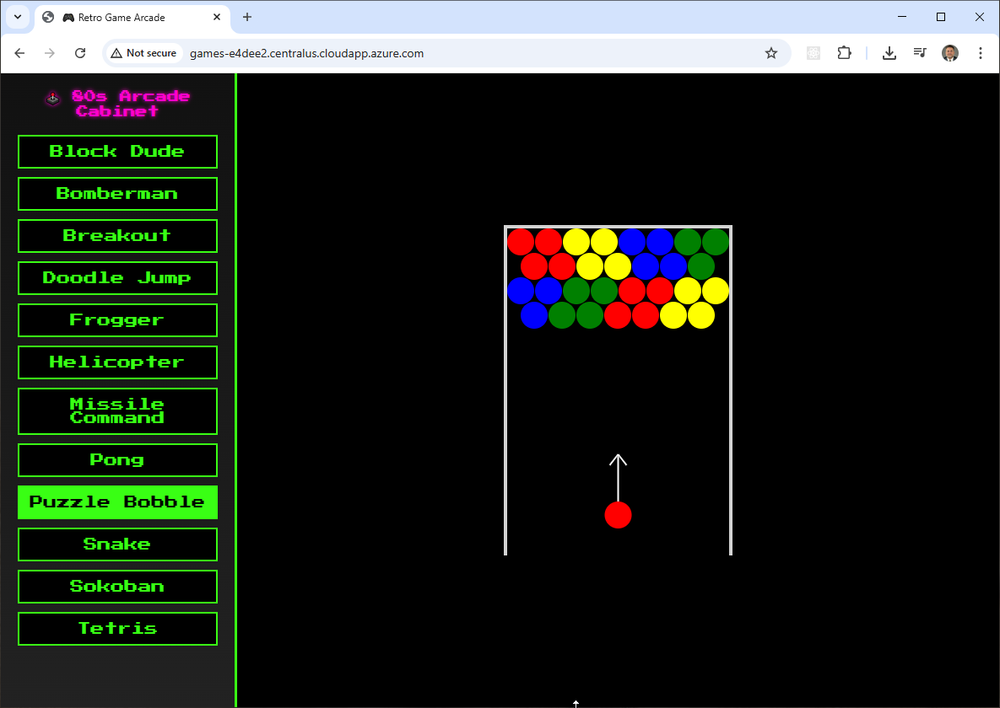
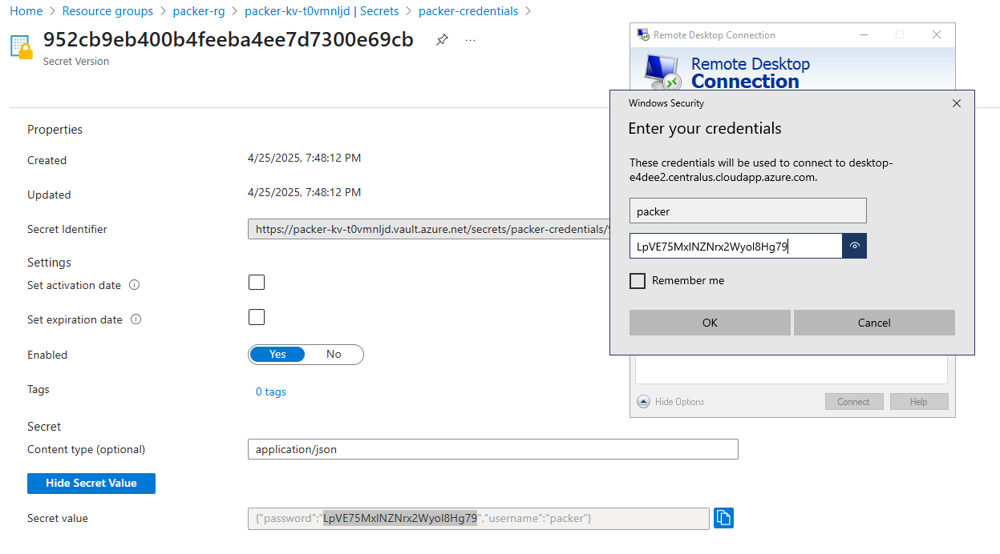
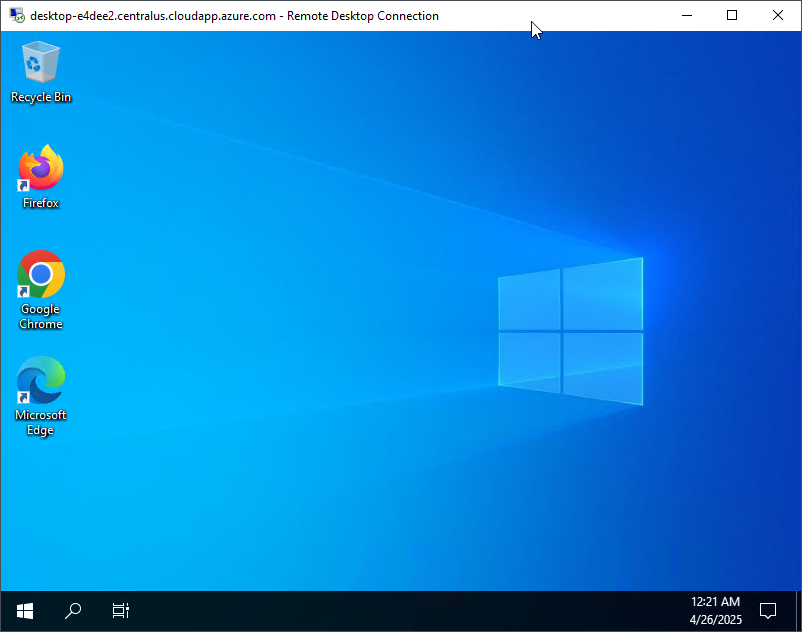

# Building VM Images in Azure with Packer

In the Azure solution, we build and deploy custom **Ubuntu** and **Windows** images using Packer.

- For **Linux**, we create an Ubuntu image with Apache installed and deploy several 80’s-style HTML games. The source for the html games can be found at [https://gist.github.com/straker](https://gist.github.com/straker)
- For **Windows**, we install Chrome and Firefox, apply the **latest Windows Updates**, and prepare the system using **Sysprep with PowerShell** commands.
- Azure doesn’t allow direct execution of PowerShell in `custom_data`, so we implement a workaround: we drop a PowerShell script as `CustomData.bin` and use a lightweight **VM extension** to execute it at boot.
- Networking is provisioned automatically by Packer using a temporary **resource group and VNet**, simplifying initial setup.
- We deploy an **Azure Bastion host** to securely interact with both Linux and Windows VMs from the Azure Portal — eliminating the need to expose public IPs or manage SSH/RDP keys manually.
- The Windows image supports **RDP** access using a local `packer` account, and the Linux image can be accessed via **HTTP** on port 80.

## Packer Workflow



## Prerequisites

* [An Azure Account](https://portal.azure.com/)
* [Install AZ CLI](https://learn.microsoft.com/en-us/cli/azure/install-azure-cli) 
* [Install Latest Terraform](https://developer.hashicorp.com/terraform/install)
* [Install Latest Packer](https://developer.hashicorp.com/packer/install)

If this is your first time watching our content, we recommend starting with this video: [Azure + Terraform: Easy Setup](https://www.youtube.com/watch?v=wwi3kVgYNOk). It provides a step-by-step guide to properly configure Terraform, Packer, and the AZ CLI.


## Download this Repository

```bash
git clone https://github.com/mamonaco1973/azure-packer.git
cd azure-packer
```

## Build the Code

Run [check_env](check_env.sh) then run [apply](apply.sh).

```bash
~/azure-packer$ ./apply.sh
NOTE: Validating that required commands are found in your PATH.
NOTE: az is found in the current PATH.
NOTE: packer is found in the current PATH.
NOTE: terraform is found in the current PATH.
NOTE: All required commands are available.
NOTE: Validating that required environment variables are set.
NOTE: ARM_CLIENT_ID is set.
NOTE: ARM_CLIENT_SECRET is set.
NOTE: ARM_SUBSCRIPTION_ID is set.
NOTE: ARM_TENANT_ID is set.
NOTE: All required environment variables are set.
NOTE: Logging in to Azure using Service Principal...
NOTE: Successfully logged into Azure.
Initializing the backend...
Initializing provider plugins...
- Finding latest version of hashicorp/azurerm...
- Finding latest version of hashicorp/random...
- Installing hashicorp/azurerm v4.27.0...
- Installed hashicorp/azurerm v4.27.0 (signed by HashiCorp)
- Installing hashicorp/random v3.7.2...
- Installed hashicorp/random v3.7.2 (signed by HashiCorp)
Terraform has created a lock file .terraform.lock.hcl to record the provider
selections it made above. Include this file in your version control repository
so that Terraform can guarantee to make the same selections by default when
you run "terraform init" in the future.

Terraform has been successfully initialized!
[...]
```

### Build Process Overview

The build process is divided into three phases:

1. **Phase 1:** Configure the network and create the project resource group.
2. **Phase 2:** Use packer to build the `games` Image and `desktop` Image using the network infrastructure from Phase 1. This part of the build takes the longest - at least 20 minutes.
3. **Phase 3:** Create the VM instances using the Images from Phase 2.


## Tour of Build Output in the Azure Console



## Test the Games Server

To test the games simply navigate to the public IP address of deployed instance in a web browser.



## Test the Desktop Server

To test the Desktop server you'll need to create an RDP session to the deployed instance. When prompted for credentials, use `packer` as the user id and then look up the password in the Azure console by viewing the `packer-credentials` secret in the project vault.




